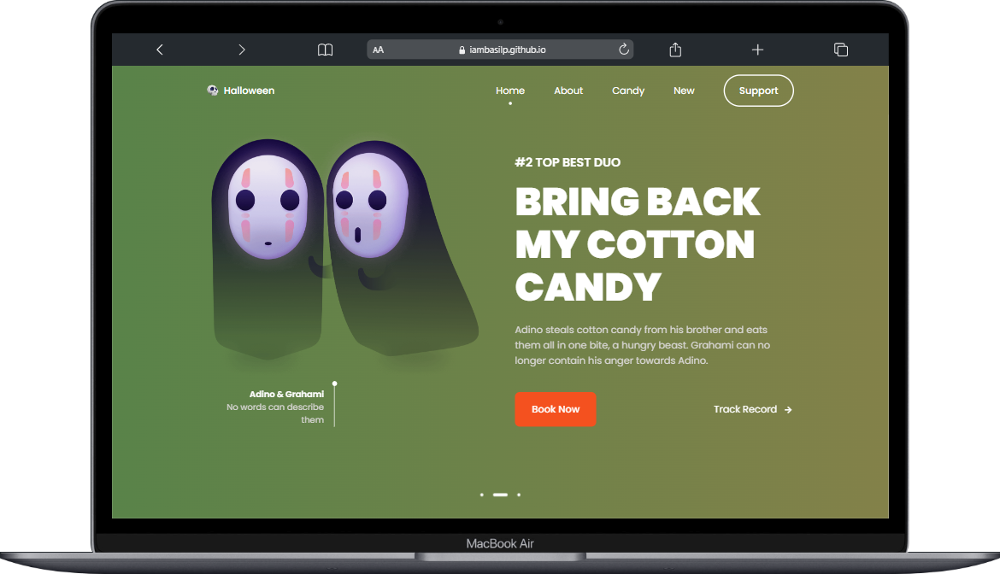

# Responsive Halloween Website 

Responsive Product website with More features . Compatible with all mobile devices and with a beautiful and pleasant user interface. 😎


## Lessons Learned

I copied from others youtube channel to undertand more responsive design and so on .......


## Preview




## Features

- Responsive Halloween Website Using HTML, CSS & JavaScript.
- Contains animations when scrolling.
- Theme available 
- Smooth scrolling in each section.
- Developed first with the Mobile First methodology, then for desktop.
- Compatible with all mobile devices and with a beautiful and pleasant user interface.

## 🛠 Skills
Javascript HTML, CSS, Remix icons, Git....


## Run Locally

Clone the project

```bash
  git clone https://link-to-project
```

Go to the project directory

```bash
  cd my-project
```

you can acess with changing commits


## Concusion

### Importance of Responsive Design : 
Responsive design allows your website content to flow freely across all screen resolutions and sizes, and renders it to look great on all devices. It also makes it unnecessary to maintain different versions of your website for mobile and desktop and saves you time, resources and efforts.


## Documentation

[Responsive design](https://developer.mozilla.org/en-US/docs/Learn/CSS/CSS_layout/Responsive_Design#:~:text=It%20is%20important%20to%20understand,used%20to%20view%20the%20content.)


## Support

For support, email basilxg321@gmail.com

